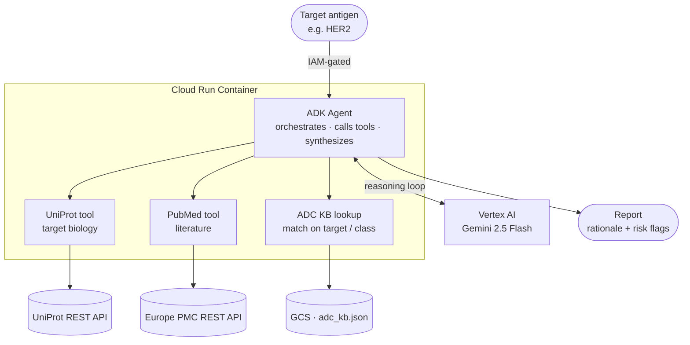

# ADC Target-Triage Agent

> An LLM agent that assesses whether a given antigen is a promising **antibody–drug conjugate (ADC)** target, by grounding its reasoning in live biological data rather than model priors alone.


---

## Overview

Choosing the right antigen for an ADC is hard: surface expression alone does not make a good target. This agent brings three independent evidence sources together and produces a structured suitability report for a queried antigen:

- **UniProt** — target biology (subcellular localization, topology, isoforms)
- **Curated ADC knowledge base** — clinical precedent (approved vs. failed programs and failure reasons)
- **Europe PMC** — supporting literature evidence

A single **Google ADK** agent, powered by **Vertex AI (Gemini 2.5 Flash)**, orchestrates these tools and synthesizes the results into a rationale with risk flags.

The repo also includes an **ablation study** comparing the tool-augmented agent against a baseline (no-tool) agent across approved, failed, and unsuitable targets.

---

## Architecture

A single Cloud Run container runs the ADK agent and its three **in-process** tools. The agent calls out to Vertex AI for reasoning, to the UniProt and Europe PMC REST APIs for live data, and to a GCS-hosted JSON knowledge base. The service is IAM-gated (no unauthenticated access).



---

## Tools

| Module | Source | Returns |
|---|---|---|
| `uniprot_API.py` | UniProt REST API | UniProt ID, entry name, protein name, canonical localization, and per-isoform subcellular locations |
| `pubmed_API.py` | Europe PMC REST API | Up to 15 papers (PMID, title, abstract) matching the antigen + ADC/antibody keywords in the title |
| `kb.py` | `adc_kb.json` in GCS | Target name, entry count, approved/failed counts, failure reasons, and curated notes |

Each function is registered as an ADK `FunctionTool`; `agent.py` defines the root agent that orchestrates them.

---

## Repository structure

```
.
├── agent.py            # Root ADK agent definition
├── uniprot_API.py      # UniProt FunctionTool
├── pubmed_API.py       # Europe PMC FunctionTool
├── kb.py               # GCS knowledge-base lookup FunctionTool
├── adc_kb.json         # Curated ADC knowledge base (hosted in GCS)
└── eval/
    ├── baseline_report.*   # No-tool agent outputs
    └── tooled_report.*     # Tool-augmented agent outputs
```

---

## Prerequisites

- A Google Cloud project with **Vertex AI**, **Cloud Run**, and **Cloud Storage** enabled
- The [Google ADK](https://google.github.io/adk-docs/) CLI installed
- `gcloud` authenticated against your project
- `adc_kb.json` uploaded to a GCS bucket


## Run locally

Test both the baseline and tool-augmented agents in the ADK development web UI:

```bash
adk web --allow_origins "regex:https://.*\.cloudshell\.dev"
```

The interface is a chat box: enter an antigen (e.g. `HER2`) and the agent returns a suitability report.

---

## Deploy

Deploy the agent and its three tools into a single serverless Cloud Run container:

```bash
adk deploy cloud_run \
  --project="$PROJECT_ID" \
  --region="$REGION" \
  --service_name=adc-agent \
  --with_ui \
  personal_assistant
```


## Usage / data flow

```
User enters antigen
      │
      ▼
Agent calls UniProt + Europe PMC + GCS KB tools
      │
      ▼
Tool results return to the agent
      │
      ▼
Gemini 2.5 Flash synthesizes a suitability report
```

---

## Evaluation

Six targets were compared between the **baseline** (no-tool) agent and the **tooled** agent, spanning approved, failed, and unsuitable cases.

| Category | Target | Key finding |
|---|---|---|
| Approved | **HER2** | Tooled agent lists all 5 approved HER2 ADCs by formal name and is more concise; baseline lists only 2. |
| Approved | **CD19** | Tooled agent surfaces a knowledge-base warning (unspecified binding) that the baseline misses — more conservative, more rigorous. |
| Failed | **PSMA** | Baseline is overly optimistic ("exceptionally suitable"), leaning on radioligand success (Pluvicto — not an ADC). Tooled agent correctly grounds in the fact that PSMA ADCs have failed. |
| Failed | **MUC16** | Baseline **hallucinates** luveltamab ravtansine (an FRα ADC) as a MUC16 agent. Tooled agent stays grounded in the recorded failure (sofituzumab vedotin; expression heterogeneity). |
| Unsuitable | **TP53** | Intracellular — not a surface ADC target; correctly absent from the KB and literature. |
| Unsuitable | **HLA-C** | Baseline reasons more completely about ubiquitous expression and on-target/off-tumor toxicity; tooled agent shows **less reasoning breadth** here. |

**Takeaway:** the tools trade reasoning *breadth* for **grounding, currency, calibration, and hallucination-resistance**. They are a clear win for failed and precedent-heavy cases, but additional tools (e.g. tissue distribution, antigen topology) are needed to match the baseline's open-ended reasoning on unsuitable targets.

---


## Security & privacy

- The Cloud Run service is **IAM-gated** with no unauthenticated access; reach it only via the authenticated proxy.
- Literature text from Europe PMC is treated as **supporting evidence, not a final verdict**, to limit the influence of irrelevant or misleading abstracts.
- *Planned hardening:* input cleaning, request rate limits, and moving API keys into **Secret Manager**.


Other lessons from building the tools:

- **UniProt parsing** — isoform entries pollute the localization output (e.g. cytoplasmic/nuclear locations appear for HER2). Resolved by separating isoforms and using only the canonical isoform for localization.
- **Literature API** — NCBI E-utilities required a two-step XML query; switching to the Europe PMC REST API reduced this to a single JSON call. Default *relevance* sorting was used after citation-count sorting returned mostly reviews.
- **Knowledge base** — the original CSV clustered aliases/acronyms in one cell per target; the final JSON stores synonyms as a pre-separated list, removing the alias-splitting logic.

---

## Limitations & roadmap

This agent addresses a **single component** of ADC design (antigen suitability) and trades some reasoning breadth for tool grounding.

Planned next steps:

- Add tools for **tissue distribution** and **antigen topology** to improve reasoning on unsuitable targets.
- Add a **deterministic Python scanner** for sequence-level analysis.
- Accept **heavy- and light-chain sequences** (e.g. from the [OAS database](https://opig.stats.ox.ac.uk/webapps/oas/)) and screen them for **developability**.
- Extend beyond the antigen to other ADC components (**linker, payload**), moving toward integrated developability, efficacy, and biosafety assessment.

---

## References

1. Google Codelabs. *Building AI Agents with ADK: The Foundation.* — https://codelabs.developers.google.com/devsite/codelabs/build-agents-with-adk-foundation
2. UniProt. *API Queries.* — https://www.uniprot.org/help/api_queries
3. Google Codelabs. *Building AI Agents with ADK: Empowering with Tools.* — https://codelabs.developers.google.com/devsite/codelabs/build-agents-with-adk-empowering-with-tools
4. Europe PMC. *RESTful Web Service.* — https://europepmc.org/RestfulWebService
5. Google Cloud Skills Boost. *Cloud Storage: Qwik Start — Google Cloud Console.* — https://www.skills.google/focuses/1760?parent=catalog
